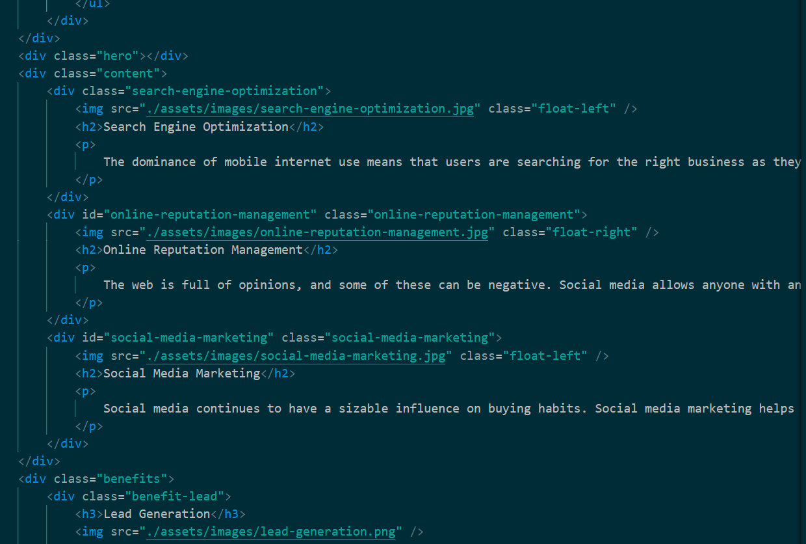
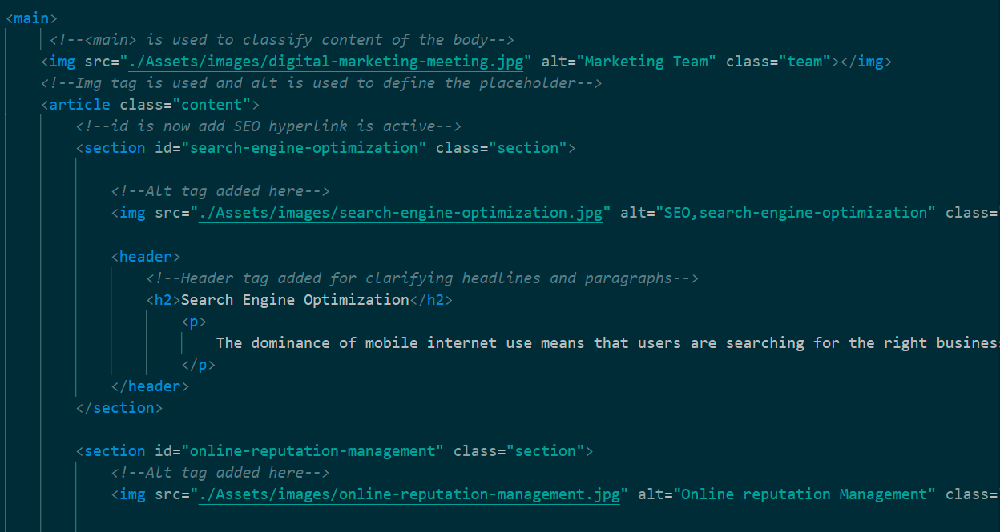
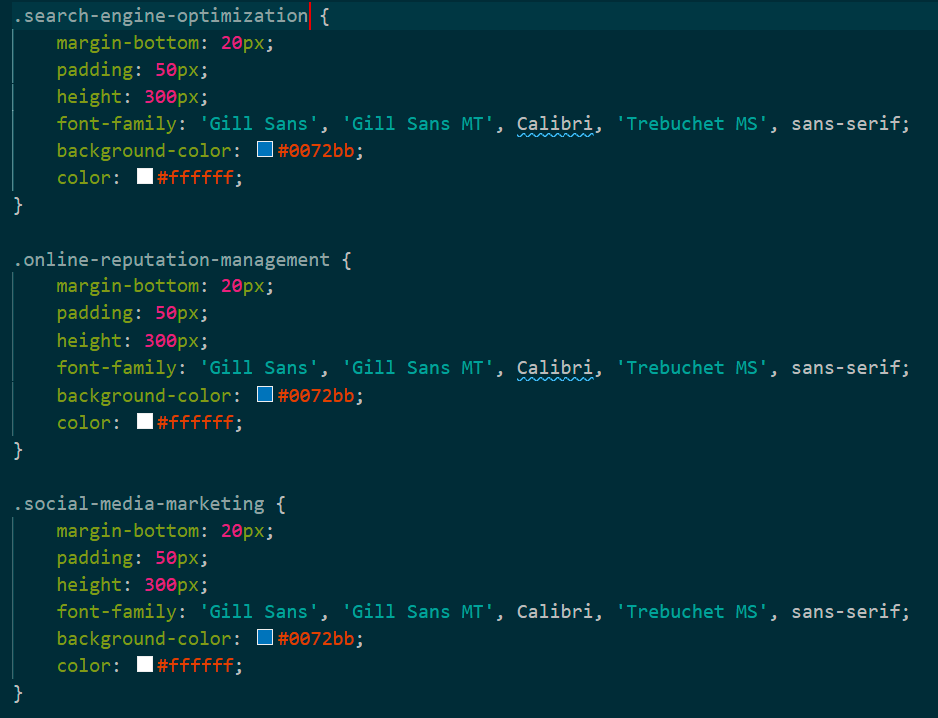
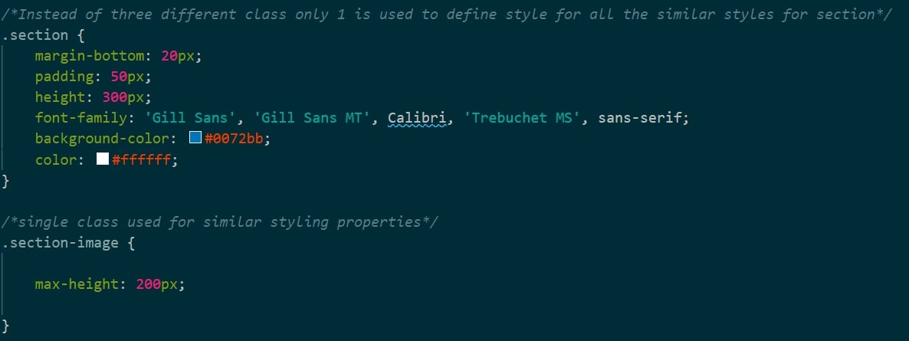

# Code-Refactor_Horiseon
## This is the first week task for Coding Bootcamp. The task is Code Refactor. As per requirement set by a marketing company there are some changes being made to the HTML and CSS file to make it more accessible without sacrificing any functionality.  

  

The title of the website is first change made. In the old html file it was titled as website which was generic now it is changed to Horiseon which gives clear indication which webpage is open when multiple tabs are used on browser.  
  

Next change was making the html more semantic. Instead of div tag which is previously used trough out the file is now changed into semantic tags which gives more clarity to the the html file and its functionality for different sections.  

## Old Html code used to look like the picture below:  

   

## New Html code with semantic tags:   

   

  
To meet the Accessibility criteria tag like nav, article, section, header and footer is used with proper indentation which makes the code more easy to understand and easy to trace. To achieve this it was arranged on basis of the figure below.   

  
   

Next major changes were made in Html classes and CSS style sheet. The old code was using new classes for each images and sections. The old CSS style sheet had same styling for different images and sections. Those were assigned 1 class and reduced the code in cascade styling sheet.  

## Before   

  

## After  
  

Standard CSS styling hierarchy is used which was not previously used. The Cascade style now starts from universal selector and goes down to more specific selectors. Comments are used through out the CSS style sheet so it explains the section of html its affecting and how its affecting.  
After the class change in html and reduced code in css the website loads faster on browser.   

### Try It HERE !!!  

<a href="https://thossain89.github.io/Code-Refactor_Horiseon/">HORISEON</a>  

## License & Copyright  
&copy; 2021 Tanvir Hossain, Coding Bootcamp ,University of Sydney and Trilogy Education   

